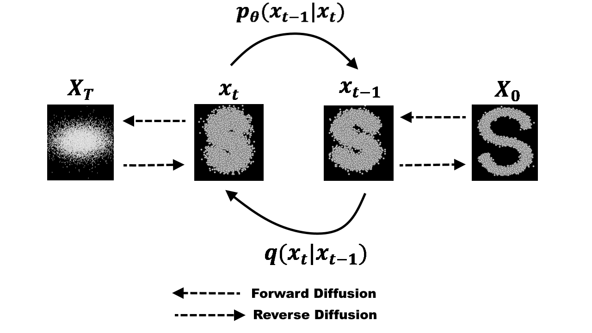

# The Art of Image Generation

*By: Atal Gupta, Vinit Singh*  
*Date: June 25, 2025*  


<div style="display: flex; flex-direction: column; margin-bottom: 20px; align-items: center;">
  <div style="display: flex; justify-content: center; gap: 40px; margin-bottom: 10px;">
    
    
  </div>
  <p style="text-align: center; font-style: italic;">
    Left: Original reference image | Right: Image generated using OpenAI with the prompt:
    "
Photorealistic rendering of two samurai warriors standing together in vibrant traditional Japanese attire. One has spiky black hair, a straw hat on his back, and wears a bright red kimono with a yellow sash and blue shoulder armor, confidently smiling. The other has short green hair, three swords—one held in his mouth—and wears a white robe with a green and black haori, standing fiercely with a determined expression. Detailed facial features, realistic skin textures, accurate sword materials (polished steel blades with ornate hilts), high-resolution fabric textures, and natural lighting. The background is a clear blue sky with scattered clouds and distant rocky cliffs, mimicking traditional Japanese landscapes. Wide-angle cinematic perspective, ultra-realistic style."
  </p>
</div>

Have you ever wondered how artificial intelligence can generate images that never existed before? The answer lies in sophisticated mathematical frameworks built upon probability theory, combinatorics, and optimization. This blog explores the mathematical foundations of generative models, demonstrating how discrete mathematics principles enable machines to create realistic images.

Modern image generation represents one of the most striking applications of probabilistic modeling in computer science. Behind every AI-generated artwork lies a complex mathematical system that transforms random noise into structured visual content through learned probability distributions.

## Mathematical Background and Foundations

### Probability Theory Fundamentals

**Definition 1 (Probability Space):** A probability space is a triple (Ω, F, P) where:
- Ω is the sample space (set of all possible outcomes)
- F is a σ-algebra on Ω (collection of events)  
- P: F → [0,1] is a probability measure satisfying P(Ω) = 1

For image generation, our sample space Ω represents all possible digital images.

**Definition 2 (Joint Probability Distribution):** For random variables X₁, X₂, ..., Xₙ, the joint probability distribution is:

```
P(X₁ = x₁, X₂ = x₂, ..., Xₙ = xₙ) = P(x₁, x₂, ..., xₙ)
```

**Chain Rule of Probability:** For any sequence of random variables:

```
P(X₁, X₂, ..., Xₙ) = P(X₁) · P(X₂|X₁) · P(X₃|X₁,X₂) · ... · P(Xₙ|X₁,...,Xₙ₋₁)
```

This fundamental rule becomes crucial in auto-regressive image generation models.

### Information Theory and Entropy

**Definition 3 (Shannon Entropy):** For a discrete random variable X with probability mass function P(X):

```
H(X) = -∑ P(x) log₂ P(x)
```

**Definition 4 (Kullback-Leibler Divergence):** The KL divergence between two probability distributions P and Q is:

```
D_KL(P||Q) = ∑ P(x) log(P(x)/Q(x))
```

This measures how one probability distribution differs from another, essential for training generative models.


## Data Representation

### Mathematical Formulation of Digital Images


Let an image I be represented as a function:

```
I: {1, 2, ..., H} × {1, 2, ..., W} × {R, G, B} → {0, 1, 2, ..., 255}
```

Where H and W are height and width in pixels.

For computational purposes, we flatten this to a vector:

```
x ∈ ℝ^(H×W×3) where x ∈ [0, 255]^(H×W×3)
```

**Example:** A 256×256 RGB image becomes a vector in ℝ^196,608.

### The Curse of Dimensionality in Image Space

**Problem Statement:** Given the image space ℝ^d where d = H×W×3, what is the probability of randomly generating a "natural" image?

**Analysis:**
- Total possible discrete images: 256^(H×W×3)
- For a 64×64 RGB image: 256^12,288 ≈ 10^29,810 possible images
- Estimated "natural" images: ≪ 10^1000 (still astronomically small relative to total space)

**Probability Calculation:**
```
P(natural image) = |Natural Images| / |Total Images| ≈ 0
```

**Theorem 2 (Volume Concentration):** In high dimensions, data concentrates near the surface of hyperspheres, leaving most of the volume empty.

**Corollary:** Random sampling in high-dimensional image space has negligible probability of producing realistic images.

**Solution Approach:** Generative models learn to map from a lower-dimensional latent space Z ⊂ ℝ^k (where k ≪ d) to the image space through a function G: ℝ^k → ℝ^d.

This transforms the problem from sampling in ℝ^d to sampling in the much more manageable ℝ^k.

## Generative Models: Mathematical Frameworks

### Auto-regressive Models

**Mathematical Foundation:**

Auto-regressive models decompose the joint probability distribution of an image using the chain rule of probability.

**Definition 5 (Auto-regressive Decomposition):** For an image represented as a sequence of pixels x₁, x₂, ..., xₙ:

```
P(x₁, x₂, ..., xₙ) = ∏ᵢ₌₁ⁿ P(xᵢ | x₁, x₂, ..., xᵢ₋₁)
```

**Computational Model:**
Each conditional probability P(xᵢ | x₁, ..., xᵢ₋₁) is parameterized by a neural network fθ:

```
P(xᵢ = k | x₁, ..., xᵢ₋₁) = softmax(fθ(x₁, ..., xᵢ₋₁))ₖ
```

where k ∈ {0, 1, ..., 255} for pixel intensities.

**Training Objective:**
Maximize the log-likelihood:

```
L(θ) = ∑ᵢ₌₁ⁿ log P(xᵢ | x₁, ..., xᵢ₋₁; θ)
```

**Algorithmic Implementation:**
1. Define pixel ordering (typically raster scan: left-to-right, top-to-bottom)
2. For each position i, predict P(xᵢ | x<ᵢ) using neural network
3. Sample xᵢ ~ P(xᵢ | x<ᵢ) during generation
4. Repeat until complete image is generated

**Complexity Analysis:**
- Training: O(n·T) where T is network evaluation time
- Generation: O(n·T) (sequential, cannot be parallelized)

**Example - PixelCNN Architecture:**
For pixel at position (i,j), the conditional probability depends only on pixels in the "causal receptive field":

```
P(xᵢⱼ | x<(i,j)) where x<(i,j) = {xₖₗ : (k,l) precedes (i,j) in ordering}
```
Think of auto-regressive models as an artist who paints a picture one brushstroke at a time, where each stroke is informed by all previous strokes. The mathematical beauty lies in the chain rule decomposition—we transform an intractable joint probability P(x₁,...,xₙ) into a product of manageable conditional probabilities.

In practice, if you're generating a 32×32 image (1,024 pixels), instead of modeling 256^1,024 possible images directly, you model 1,024 conditional distributions, each with 256 outcomes. This reduces computational complexity from exponential to linear in the number of pixels.

This approach guarantees that each pixel is conditioned only on previously generated pixels, maintaining the auto-regressive property.

### Variational Autoencoders (VAEs)

**Mathematical Foundation:**

VAEs combine variational inference with neural networks to learn latent representations of images.

**Problem Setup:**
- Observed data: x ∈ ℝᵈ (images)
- Latent variables: z ∈ ℝᵏ (where k ≪ d)
- Prior: p(z) = 𝒩(0, I)
- Likelihood: pθ(x|z) (decoder network)
- Posterior: qφ(z|x) (encoder network)

**Variational Lower Bound:**
The evidence lower bound (ELBO) is:

```
ELBO = 𝔼qφ(z|x)[log pθ(x|z)] - D_KL(qφ(z|x) || p(z))
```

**Theorem 3 (ELBO Derivation):**
For any variational distribution qφ(z|x):

```
log p(x) ≥ ELBO = ∫ qφ(z|x) log[pθ(x|z)p(z)/qφ(z|x)] dz
```

**Proof:**
Using Jensen's inequality on the concave logarithm function.

**Parameterization:**
- Encoder: qφ(z|x) = 𝒩(μφ(x), σ²φ(x)I)
- Decoder: pθ(x|z) = 𝒩(μθ(z), σ²I) or Bernoulli for binary images

**Reparameterization Trick:**
To enable backpropagation through stochastic layers:

```
z = μφ(x) + σφ(x) ⊙ ε, where ε ~ 𝒩(0, I)
```

**Training Algorithm:**
1. Forward pass: x → (μφ(x), σφ(x)) → z → μθ(z)
2. Compute ELBO loss
3. Backpropagate through reparameterized samples

**Generation Process:**
1. Sample z ~ 𝒩(0, I)
2. Generate x = μθ(z)

VAEs solve a fundamental problem: how do we find a low-dimensional representation that captures the essence of high-dimensional data? The mathematical insight is profound—by forcing the latent representation to follow a known distribution (usually Gaussian), we create a continuous space where interpolation makes semantic sense.

The reparameterization trick is mathematically elegant: instead of sampling directly from qφ(z|x), we sample deterministic noise ε and transform it. This allows gradients to flow through the stochastic layer, enabling end-to-end training.

### Generative Adversarial Networks (GANs)

**Mathematical Foundation:**

GANs formulate image generation as a two-player zero-sum game between a generator and discriminator.

**Game-Theoretic Formulation:**

```
min_G max_D V(D,G) = 𝔼_x~p_data[log D(x)] + 𝔼_z~p_z[log(1 - D(G(z)))]
```

Where:
- G: ℝᵏ → ℝᵈ (generator network)
- D: ℝᵈ → [0,1] (discriminator network)
- p_data: true data distribution
- p_z: prior noise distribution (typically 𝒩(0,I))

**Theorem 4 (Global Optimum):** The global optimum of the GAN objective occurs when p_g = p_data, where p_g is the generator's distribution.

**Proof Sketch:**
At optimum, the discriminator cannot distinguish real from generated data: D*(x) = 1/2 for all x.

**Training Algorithm (Alternating Optimization):**
1. **Discriminator Update:**
   ```
   max_D [𝔼_x~p_data[log D(x)] + 𝔼_z~p_z[log(1 - D(G(z)))]]
   ```

2. **Generator Update:**
   ```
   min_G 𝔼_z~p_z[log(1 - D(G(z)))]
   ```
   (Often replaced with max_G 𝔼_z~p_z[log D(G(z))] for better gradients)

**Convergence Analysis:**
The GAN training corresponds to minimizing the Jensen-Shannon divergence:

```
JSD(p_data || p_g) = 1/2 D_KL(p_data || M) + 1/2 D_KL(p_g || M)
```

where M = (p_data + p_g)/2

GANs formulate generation as a minimax game, drawing from game theory. The mathematical equilibrium occurs when the generator's distribution perfectly matches the data distribution. The discriminator acts as a learned distance metric, providing increasingly sophisticated feedback to the generator.

The key insight is that we're approximating the data distribution without explicitly modeling it—the discriminator implicitly defines what "realistic" means through adversarial training.

### Diffusion Models

**Mathematical Foundation:**



Diffusion models learn to reverse a gradual noising process through score-based generative modeling.

**Forward Process (Noise Addition):**
Define a Markov chain that gradually adds Gaussian noise:

```
q(x₁:T | x₀) = ∏ᵗ₌₁ᵀ q(xₜ | xₜ₋₁)
```

where:
```
q(xₜ | xₜ₋₁) = 𝒩(xₜ; √(1-βₜ) xₜ₋₁, βₜI)
```

**Closed-form Forward Process:**
Using the reparameterization αₜ = 1 - βₜ and ᾱₜ = ∏ˢ₌₁ᵗ αₛ:

```
q(xₜ | x₀) = 𝒩(xₜ; √ᾱₜ x₀, (1-ᾱₜ)I)
```

**Reverse Process (Denoising):**
Learn to reverse the forward process:

```
pθ(x₀:T) = p(xT) ∏ᵗ₌₁ᵀ pθ(xₜ₋₁ | xₜ)
```

where:
```
pθ(xₜ₋₁ | xₜ) = 𝒩(xₜ₋₁; μθ(xₜ,t), Σθ(xₜ,t))
```

**Training Objective:**
Minimize the variational lower bound:

```
L = 𝔼q[∑ᵗ₌₁ᵀ D_KL(q(xₜ₋₁|xₜ,x₀) || pθ(xₜ₋₁|xₜ))]
```

**Simplified Training Loss:**
The loss reduces to:

```
L_simple = 𝔼t,x₀,ε [||ε - εθ(√ᾱₜ x₀ + √(1-ᾱₜ) ε, t)||²]
```

where εθ is a neural network that predicts the noise ε ~ 𝒩(0,I).


**Generation Algorithm:**
1. Sample xT ~ 𝒩(0,I)
2. For t = T, T-1, ..., 1:
   ```
   xₜ₋₁ = 1/√αₜ (xₜ - βₜ/√(1-ᾱₜ) εθ(xₜ,t)) + σₜz
   ```
   where z ~ 𝒩(0,I) and σₜ is the noise schedule.

**Score-based Interpretation:**
The noise prediction εθ is related to the score function:

```
∇x log q(xₜ) = -εθ(xₜ,t)/√(1-ᾱₜ)
```

This connects diffusion models to score-based generative modeling theory.

Diffusion models exploit a deep connection to thermodynamics and stochastic processes. The forward process increases entropy (adds noise), while the reverse process decreases entropy (removes noise). The mathematical framework connects to Langevin dynamics and score-based modeling.

The remarkable property is that by learning to predict noise at each timestep, the model implicitly learns the score function ∇ₓ log p(x), which fully characterizes the data distribution.


### Comparative Analysis

| Model Type | Mathematical Foundation | Strengths | Computational Complexity |
|------------|------------------------|-----------|-------------------------|
| Auto-regressive | Chain rule of probability | Exact likelihood, stable training | O(n) generation time |
| VAE | Variational inference | Fast generation, interpretable latent space | O(1) generation time |
| GAN | Game theory, adversarial training | High-quality samples | O(1) generation time |
| Diffusion | Stochastic processes, score matching | State-of-the-art quality | O(T) generation time |


## Conclusion

This exploration demonstrates how fundamental mathematical concepts from discrete mathematics, probability theory, and optimization enable sophisticated image generation capabilities. The key insights are:

1. **Probabilistic Modeling:** All successful generative models learn to approximate the underlying data distribution through different mathematical frameworks.

2. **Dimensionality Reduction:** The curse of dimensionality necessitates learning lower-dimensional representations or structured dependencies.

3. **Mathematical Rigor:** Each model class addresses the generation problem through rigorous mathematical formulations—chain rule decomposition, variational inference, game theory, and stochastic processes.

4. **Computational Trade-offs:** Different mathematical approaches lead to different computational characteristics, affecting training stability, generation speed, and sample quality.

The mathematics of generative models illustrates how abstract mathematical concepts translate into practical applications that are transforming creative industries. As computational resources continue to grow, these mathematical foundations will enable even more sophisticated approaches to artificial creativity.

For undergraduate students, this field represents an excellent intersection of theoretical mathematics and practical applications, demonstrating the power of probability theory, optimization, and discrete mathematics in solving real-world problems.

## References

1. Goodfellow, I., et al. (2014). "Generative Adversarial Networks." *Advances in Neural Information Processing Systems*. arXiv:1406.2661.

2. Kingma, D. P., & Welling, M. (2013). "Auto-Encoding Variational Bayes." *International Conference on Learning Representations*. arXiv:1312.6114.

3. Ho, J., Jain, A., & Abbeel, P. (2020). "Denoising Diffusion Probabilistic Models." *Advances in Neural Information Processing Systems*. arXiv:2006.11239.

4. van den Oord, A., et al. (2016). "Pixel Recurrent Neural Networks." *International Conference on Machine Learning*. arXiv:1601.06759.

5. Bishop, C. M. (2006). *Pattern Recognition and Machine Learning*. Springer.

6. Murphy, K. P. (2012). *Machine Learning: A Probabilistic Perspective*. MIT Press.

7. Blei, D. M., Kucukelbir, A., & McAuliffe, J. D. (2017). "Variational Inference: A Review for Statisticians." *Journal of the American Statistical Association*, 112(518), 859-877.

8. Song, Y., & Ermon, S. (2019). "Generative Modeling by Estimating Gradients of the Data Distribution." *Advances in Neural Information Processing Systems*. arXiv:1907.05600.

9. Dhariwal, P., & Nichol, A. (2021). "Diffusion Models Beat GANs on Image Synthesis." *Advances in Neural Information Processing Systems*. arXiv:2105.05233.

10. Razavi, A., et al. (2019). "Generating Diverse High-Fidelity Images with VQ-VAE-2." *Advances in Neural Information Processing Systems*. arXiv:1906.00446.